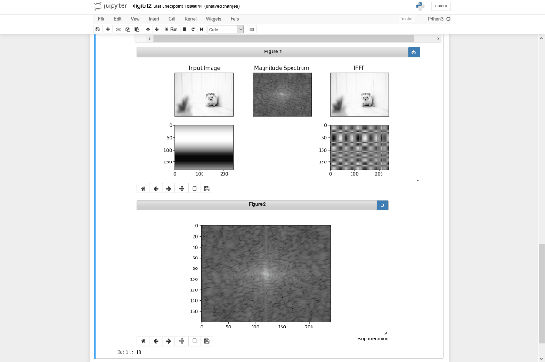

1. プログラムとその説明

- digital2.pynbのコード
```py
# -*- coding: utf-8 -*-
# cv2によるフーリエ変換と逆フーリエ変換
import numpy as np
import cv2
from matplotlib import pyplot as plt
%matplotlib notebook 
# inlineで実行するとマウスで選択できないので、notebookで実行する
        
# 画像の読み込み
im = cv2.imread('origin.jpg',0)
# 画像のリサイズ
im = cv2.resize(im,(240,180))

# clicklogの初期化
clicklog = np.zeros(im.shape)

# フーリエ変換
f = cv2.dft(np.float32(im), flags = cv2.DFT_COMPLEX_OUTPUT)
dft_shift = np.fft.fftshift(f)
magnitude_spectrum = 20*np.log(cv2.magnitude(dft_shift[:,:,0],dft_shift[:,:,1]))

# 逆フーリエ変換
dft_ishift = np.fft.ifftshift(dft_shift)
img_back = cv2.idft(dft_ishift)
img_back = cv2.magnitude(img_back[:,:,0],img_back[:,:,1])

# sin波の切り抜き
def mkWave(x, y):
    yahoo=np.zeros(im.shape)
    yahoo[y, x] = 1
    wave = cv2.idft(yahoo)
    return wave

# sin波の合成
def reset(A):
    google = np.zeros(dft_shift.shape)
    google[:,:,0] = A # Aを1にすると全て選択されたことになり、結果を見ると元に戻ることが分かる
    google[:,:,1] = A # 同上
    copy = dft_shift*google
    copy = np.fft.ifftshift(copy)
    copy = cv2.idft(copy)
    re = cv2.magnitude(copy[:,:,0],copy[:,:,1])
    return re

# クリック時の処理
def onclick(event):
    global clicklog, X, Y
    # 左クリック&ドラッグ時の挙動
    if event.button==1:
        X=int(round(event.xdata))
        Y=int(round(event.ydata))
        
        ax7.plot(X, Y, marker='.', markersize='1')    
        
        clicklog[Y, X] = 1
        
        # リアルタイム表示にするには、以下のコメントアウト&116行目「fig2.canvas.mpl_connect('button_release_event', onrelease)」を解除(高負荷)
#         wave = mkWave(X, Y)
#         ax6.imshow(wave, cmap='gray')
        
#         reim = reset(X, Y, clicklog)
#         reim = np.float32(reim)
#         ax4.imshow(reim, cmap='gray')
        
#         plt.draw()

# qを押したら終了(figure1とfigure2でそれぞれqを押す必要あり)
def onkey(event):
    if event.key == 'q':
        sys.exit()

# 指を離したら計算を実行する(高負荷を回避, リアルタイムではなくなる)
def onrelease(event):
    global clicklog, X, Y
    wave = mkWave(X, Y)
    ax6.imshow(wave, cmap='gray')
    
    reim = reset(clicklog)
    reim = np.float32(reim)
    ax4.imshow(reim, cmap='gray')
    
    plt.draw()
    
# figure準備
fig = plt.figure(figsize=(9,4))

ax1 = fig.add_subplot(2,3,1)
ax1.imshow(im, cmap='gray')
ax1.set_title('Input Image')
ax1.set_xticks([]), ax1.set_yticks([])

ax2 = fig.add_subplot(2,3,2)
ax2.imshow(magnitude_spectrum, cmap='gray')
ax2.set_title('Magnitude Spectrum')
ax2.set_xticks([]), ax2.set_yticks([])

ax3 = fig.add_subplot(2,3,3)
ax3.imshow(img_back, cmap='gray')
ax3.set_title('IFFT')
ax3.set_xticks([]), ax3.set_yticks([])

ax4 = fig.add_subplot(2,3,4)

ax6 = fig.add_subplot(2,3,6)

fig2=plt.figure(figsize=(8,4))

ax7 = fig2.add_subplot(1,1,1)
ax7.imshow(magnitude_spectrum, cmap='gray')

plt.subplots_adjust(left=None, bottom=None, right=None, top=None, wspace=0.5, hspace=0)

# マウスイベント
fig2.canvas.mpl_connect('button_press_event', onclick)
fig2.canvas.mpl_connect('motion_notify_event', onclick)
fig2.canvas.mpl_connect('button_release_event', onrelease)
fig2.canvas.mpl_connect('key_press_event', onkey)
```

- プログラムの説明  
   1. cv2, numpy, matplotlib.pyplotを読み込み、notebookで実行する(inlineで実行するとマウスの座標取得ができない)
   2. カレントディレクトリ内にある、画像ファイルorigin.jpgを読み込み、画像サイズが大きいと処理が重くなるのでリサイズする
   3. クリックした座標を記録するための変数を宣言する。
   4. フーリエ変換の関数を定義、numpyよりも高速で処理ができるcv2で準備された関数を使用する。numpyのシフト関数で本来、真ん中に来てほしい点が左上に来てしまうのを調整する。
   5. 逆フーリエ変換の関数を定義、フーリエ変換の関数で計算されたシフト済みのデータを、逆シフトしてから逆フーリエ変換を行う。
   6. パワースペクトルにおける選択された座標の一点一点のsin波を切り抜く関数を定義、シフト済みのデータと同じ方の配列を準備する。この配列は、cv2のフーリエ変換関数を行った、三次元配列であることに注意する。よって、選択された座標を1として記録したclicklogとかけ算を行うには型をそろえる必要があり、実数部と虚数部で分かれて格納されている三次元データを関数内で二次元配列に変換している。その後、行列のかけ算を行い、逆シフトして、逆フーリエ変換して、cv2のmagnitude関数で絶対値をとる。以上で、切り抜いたsin波の合成を行える
   7. マウスでクリック時の挙動を定義する、event.button==1は、「左クリックされたら」の意味である。選択された座標をX, Yに代入する。選択された場所が視覚的に分かりやすいように点をプロットする。コードにコメントアウトしている通り、指定された場所のコメントアウトを解除すると、よりリアルタイムで表示できるが行列計算が増えるため、高負荷かかり、処理が遅くなる。
   8. キーボードのqが押されたらプログラムを終了する関数を定義する
   9. マウスのクリックを離すと計算が実行されるように定義する
   10. figureを準備する
   11. マウスのクリックやドラッグ、リリースされた座標、キーボードの押下された種類を管理し、指定された関数を実行する。

1. 使い方，実行の仕方，依存ライブラリとバージョン

    - 使い方・実行の仕方
        - digital2.ipynbダウンロードし、jupyter notebookを起動。ctrl+Enterでコードを実行(カレントディレクトリにあらかじめファイル名"origin.jpg"を用意しておくか、代わりとなるファイル名にコードを書き換える)
        - figure2の画像を中心付近を中心にクリックかドラッグで座標を選択する
        - 元に戻す際、ど真ん中をクリックしないとなかなか元に戻らないので注意
        - figure1の左上に元の画像、上真ん中にパワースペクトル、右上に逆フーリエ画像、左下に選択した座標のsin波を逆フーリエしたものを合成したもの、右下に最後に選択した座標のsin波
    - 依存ライブラリとバージョン  (osを除く)
        - opencv-python　　4.1.0.25  
        - numpy　　1.16.4  
        - matplotlib　　3.1.0

   - 参考にしたサイトなどへのリンク  
     - Opencv フーリエ変換
    http://labs.eecs.tottori-u.ac.jp/sd/Member/oyamada/OpenCV/html/py_tutorials/py_imgproc/py_transforms/py_fourier_transform/py_fourier_transform.html 
       
        参考箇所・・・フーリエ変換・逆フーリエ変換  
     - 「Qiita」インタラクティブにmatplotlibでお絵かき
    https://qiita.com/watakandhi/items/41924b082d76bbf3c31f
     
        参考箇所・・・座標の取得
 

2. 実行の様子  

    